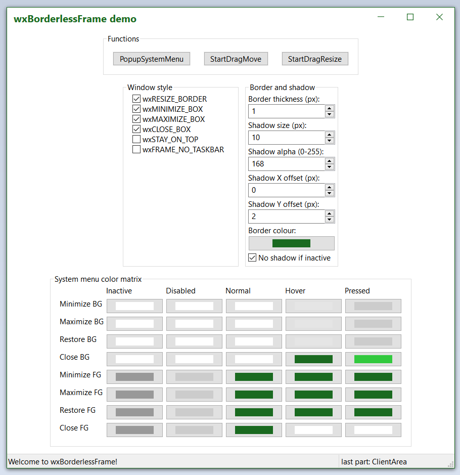

# wxBorderlessFrame

**wxBorderlessFrame** is a simple extension for [wxWidgets](https://github.com/wxWidgets/wxWidgets) that increases its capabilites in creating windows with no system-drawn decorations. That way you can create a frame with a custom-drawn titlebar, customizable border and shadow. Currently, Windows and GTK ports are supported. This is how the demo frame looks like under Windows 10, Windows 7 (with visual styles disabled) and Linux (GTK):

## Approach

It is suprisingly hard to create a resizable frame with no system decorations, but still having a shadow, under Windows. So hard that it might not even be possible to do the clean way. This library uses a hacky approach used by Microsoft Office package (and it seems that Qt also uses it). The main frame is not a single window but consists of as much as five windows. The first one contains the frame contents, and the remaining four windows are semi-transparent and mimick the shadow casted by each of the four frame edges. Why a single window combining all shadows below the main frame is not used? Not sure, but I guess the Windows desktop compositor is slow or resource hungry.

On GTK, wxBorderlessFrame uses CSS stylesheets to achieve its goals in a much more pleasurable way.

## How to use?

Look at the provided example for feature showcase. But for the basic usage, you simply need to:
+ change the base class of your window from `wxFrame` to `wxBorderlessFrame`
+ reimplement the virtual method called `GetWindowPart()` to return, what window part is the mouse currently hovering over
+ optionally draw your custom titlebar with window menu, preferably using classes the library provides (`wxSystemButtonsFactory`)

## Additional features

wxBorderlessFrame supports Windows 11 Snap Layouts out of the box:

## Requirements

+ CMake 3 (supports Windows and Linux builds) or Visual Studio 2022 (for Windows builds)
+ wxWidgets 3.1.0+ (`FromDIP()` function is commonly used)
+ vcpkg (optionally) for dependency management

## Documentation

wxBorderlessFrame uses Doxygen to generate its documentation. 

## License

wxBorderlessFrame is licensed under [wxWidgets license](LICENSE.txt).
